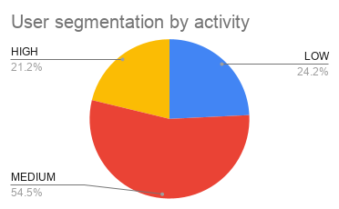
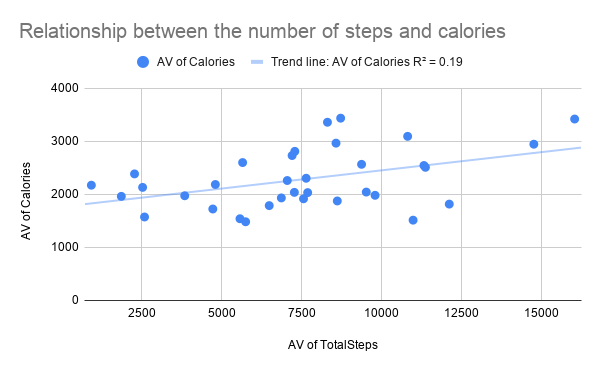
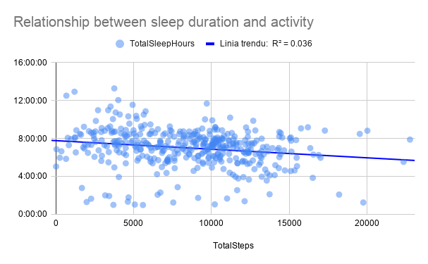

# 📊 Bellabeat Case Study – Data Analysis Project
# 🧠 Business Task

The goal of this analysis is to understand how users interact with fitness tracking devices in order to support Bellabeat’s marketing strategy.

# 📁 Data Source

The dataset comes from Kaggle and contains Fitbit user data, including daily activity and sleep tracking.

- 33 users
- 410 observations (after cleaning and merging)
- Date range: April–May 2016
- Data: steps, calories, sleep

# 🧹 Data Cleaning

- Data cleaning was performed independently on sleep and activity data.
- The cleaning included checking for duplicates, removing nulls, standardizing the date format, and checking the ID length.
- Activity and sleep data were combined by ID and Date.
- Only observations with complete data (410 rows) were included in the activity and sleep correlation analysis.
- Sleep time was converted to hours.
- Sleep efficiency was calculated.

# 📈 Analysis

|  | Activity|
|:---|:---|
|Description of operation:|Activity analysis activities included:  - Creating a pivot table aggregating data at the user (ID) level, including average step count and average calorie burn.  - Segmenting users based on average step count to identify activity levels.  - Creating an additional pivot table for supplementary analysis.  - Analyzing the number of active days for users during the study period to assess activity regularity.  - Analyzing the correlation between step count and calorie burn.|
|Questions:|Do users with higher step counts burn more calories?   Which user segment is the largest?  Is there a large discrepancy in step counts between low- and high-activity users?|
|Thoughts and conclusions:|Users with higher levels of physical activity report a higher number of days of recorded activity, which may indicate greater engagement with the device. At the same time, the differences between segments are relatively small (around 6 days in the analyzed period), suggesting that activity level is not strongly associated with regular use of the tracker.  User segmentation revealed significant differences in activity levels. Low-active users average approximately 2,936 steps per day, while highly active users average approximately 12,488 steps, almost four times more. Moderately active users constitute the largest group, achieving approximately 7,620 steps per day, indicating that most users are at a moderate level of activity.  The analysis revealed a positive but relatively weak relationship between step count and calories burned (R² ≈ 0.19). This means that step count explains only a small portion of the variability in calorie burn, suggesting that other factors, such as activity intensity, individual user characteristics, and other forms of exercise, also play a significant role.|

#### User Segmentations

#### Steps vs Calories

| | Sleep analysis|
|:---|:---|
|Description of operation:|Sleep data is tied to the day the sleep session began, meaning it doesn't accurately reflect the midnight-to-midnight cycle. This can impact daily analysis, but doesn't significantly impact overall trend analysis.  Sleep analysis efforts included:  - Converting minutes to sleep duration   - User segmentation based on average sleep duration   - Sleep efficiency segmentation|
|Questions:|Are users getting enough sleep?  Is there significant variation between users?   Are most results below 6 hours?|
|Thoughts and conclusions:|Sleep quality was operationally defined based on sleep duration, which is a simplification and does not take into account factors such as sleep continuity or sleep phases.   The analysis shows that the majority of users (47.46%) sleep between 6 and 8 hours per night. At the same time, 24.21% of observations indicate sleep less than 6 hours, which may suggest sleep deprivation in a significant portion of the population. Users with the longest sleep duration (over 8 hours) constitute 28.33% of the study participants and sleep an average of about 9 hours and 43 minutes.  Sleep efficiency for users with average and high sleep duration is very similar (93.63% and 93.71%, respectively), suggesting that sleep duration does not significantly impact sleep efficiency.  24 of 33 users track sleep|

| |Sleep vs Activity|
|:---|:---|
|Description of operation:|Sleep data is available for only a subset of observations, which may indicate irregular device use at night and introduce bias into the analysis. Analysis was limited to days when both activity and sleep data were available, ensuring a consistent comparison. However, it should be noted that this may limit the sample to more engaged users. Of the over 900 rows of activity data, only 410 corresponding sleep data rows are available. Analysis activities for the sleep and activity summary included:  - Creating a new table containing only sleep and step data   - Adding activity level and sleep efficiency to the summary   - Creating a secondary pivot table that included average sleep time and average sleep efficiency for each user segment   - Visualizing the sleep vs. activity relationship|
|Questions:|Does more activity translate into better sleep?|
|Thoughts and conclusions:|The analysis revealed no significant relationship between physical activity level and sleep duration (R² ≈ 0.04). A very weak negative relationship was observed, but its strength was too low to be considered significant. The results suggest that step count is not a significant factor in sleep duration.  Analysis of activity segments revealed that users with higher activity levels achieved, on average, shorter sleep duration and slightly lower sleep efficiency. However, these differences were relatively small, and previous correlation analysis indicated no significant relationship between activity and sleep.  Users with higher levels of physical activity achieved slightly shorter sleep duration and lower sleep efficiency compared to less active users. However, these differences were small and - combined with the very low correlation (R² ≈ 0.04) - suggested no significant relationship between physical activity and sleep. This may indicate that other factors, such as lifestyle, daily schedule, or stress levels, influence sleep quality and duration.|

#### Activity vs sleep

  
# 🔍 Key Insights

- Users vary significantly in activity level (approx. 3,200 vs 12,480 steps daily)
- The largest group consists of moderately active users (~7,700 steps/day)
- Weak positive relationship between steps and calories (R² ≈ 0.18)
- No significant relationship between physical activity and sleep (R² ≈ 0.036)
- More active users tend to sleep slightly less and have slightly lower sleep efficiency
  
# ⚠️ Limitations

- Small sample size (33 users)
- Missing sleep data for many days
- Analysis based on a single month
- Aggregation may reduce observed relationships
  
# 💡 Recommendations

Activity and sleep monitoring features should be treated as independent areas of the product. Increasing physical activity alone doesn't directly translate to improved sleep quality, so it's worth developing dedicated sleep support features, such as habit analysis, reminders, and recovery recommendations.
- Treat activity and sleep tracking as independent product areas
- Promote sleep features as a key value proposition
- Target low-activity users with engagement campaigns
- Introduce reminders to increase consistency of device usage
  
# 🛠 Tools Used
- Google Spreadsheet (data cleaning, analysis, pivot tables)
- GitHub (project presentation)

# 📌 Future Work
- Extend analysis using SQL
- Build dashboard in Tableau
- Use full dataset
